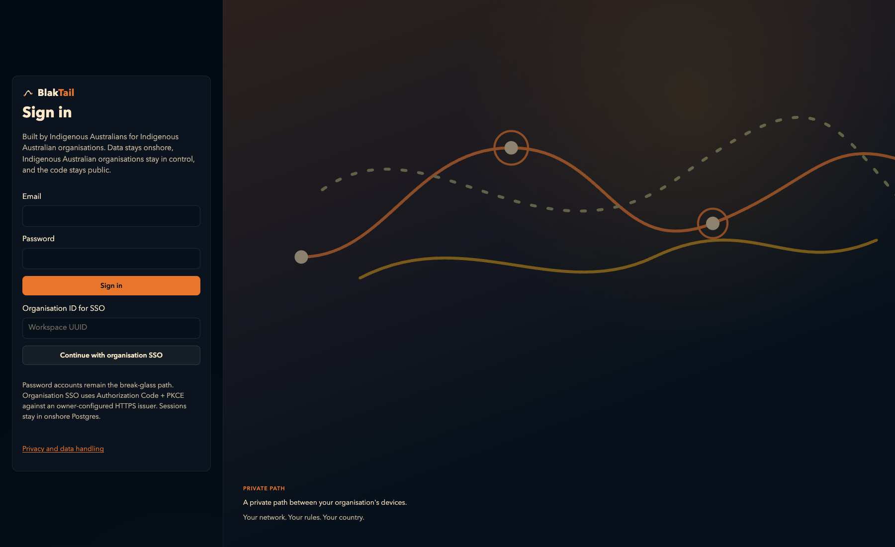
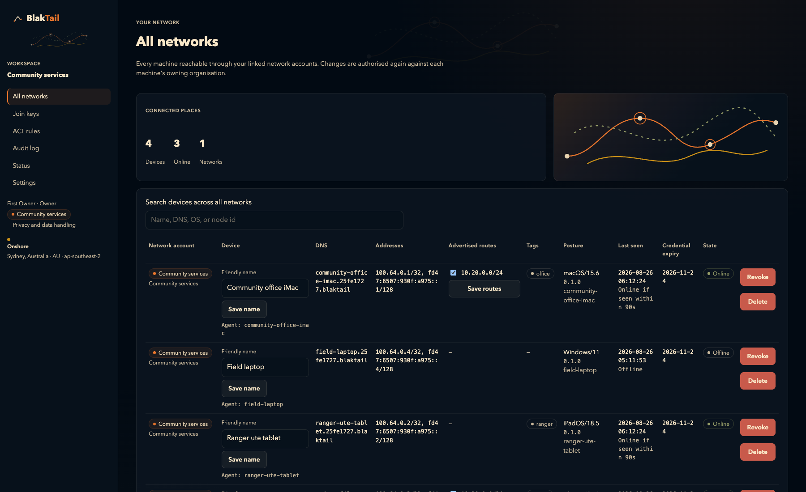

# BlakTail


## A private path between your organisation's devices

BlakTail is open, self-hosted private networking designed for Indigenous
Australian organisations. It connects laptops, field devices, servers, and sites
with encrypted WireGuard links while keeping control of identity, policy, keys,
and operational data with the organisation.

> Built by Indigenous Australians for Indigenous Australian organisations. Data stays onshore, Indigenous Australian organisations stay in control, and the code stays public.

The project is designed for onshore operation, organisation control, and
public-code transparency.

The idea is closer to a **BlakPath** than a generic VPN: a trusted path between
the people, devices, services, and places an organisation already manages. The
repository, console, and binaries retain the **BlakTail** name during pre-release
so operators have one consistent technical identity.

### What that means in practice

- **Your network:** each organisation has its own private address space, device
  inventory, MagicDNS names, routes, and access rules.
- **One live session:** one person can explicitly link independently
  authenticated login identities and see every accessible network account in one
  **All networks** machine view. Linking never copies provider credentials,
  tokens, or MFA state, and reaching another network never requires
  logout/login profile switching.
- **Your rules:** owners and admins approve enrolment, assign tags, give devices
  friendly names, approve routes, audit changes, and revoke access.
- **Your country:** the supplied cloud deployment is pinned to Sydney, and the
  project documents which data and supporting systems must remain onshore.
- **Your choice:** run it yourself, inspect the code, and move between supported
  hosts without depending on a closed SaaS control plane.

## How onboarding feels

1. Run `blaktaild up` on a new Linux or macOS device.
2. Open the short browser link it prints and sign in to the organisation portal.
3. Check the requested device name and WireGuard-key fingerprint, then approve it.
4. Give the device a clear friendly name such as “Community office iMac” or
   “Ranger ute tablet”. The technical hostname and MagicDNS identity stay stable.
5. Connect by private address or name. Direct UDP is preferred; the Australian
   relay is the encrypted fallback.

## Console

The operator console uses the night-sky brand from the artwork above. These
shots are from a throwaway inventory with invented organisation and device
names. Sign-in was captured before credentials were entered. The device view
contains no enrollment code, WireGuard fingerprint, cookie, key, or cloud
secret.





## Project status

BlakTail is pre-release. There is no hosted product and no published agent tag
or installer. Operators build from source until the release checklist in
[docs/releases.md](docs/releases.md) is complete on clean hosts.

Today it is an organisation-run private path: a night-sky operator console, a
Rust coordinator and Australian relay, WireGuard agents for Linux and macOS, and
a native macOS endpoint manager. A person can sign in once, enrol machines,
give them friendly names, apply tags and routes, and reach authorised devices
over IPv4 and IPv6. One session can show every machine across explicitly linked
network accounts.

“Onshore” is a deployment duty as well as a product rule. Included AWS
infrastructure is pinned to Sydney and the relay rejects non-Australian cloud
region identifiers. Self-hosters must keep the console database, coordinator
state, TLS proxy, logs, backups, DNS, and support tooling in Australia.

## What it is today

- Open, self-hosted private networking for Indigenous Australian organisations
- Encrypted WireGuard paths between laptops, field devices, servers, and sites
- Organisation-held identity, policy, keys, and operational data
- One live login across many network accounts, without logout/login switching
- An operator console, Linux/macOS agents, a macOS desktop manager, and an iPhone client
- Optional organisation SSO (OIDC) with a password owner as the break-glass path
- An Australian relay as the encrypted fallback when a direct UDP path fails

## What works today

- First-owner bootstrap, disabled public sign-up, and one-use invitations
- Browser enrolment and join-key enrolment for automation
- Linked login identities and one **All networks** inventory
- Stable technical and MagicDNS identity, with editable audited friendly names
- Tags, people groups, ACL rules, advertised-route approval, revoke, and tombstone
- Linux subnet routers and opt-in IPv4 exit nodes
- Dual-stack overlay addresses (CGNAT IPv4 plus an organisation ULA `/64`)
- Device posture: last-seen/online, OS, agent version, search
- Owner-minted `/api/v1` automation credentials
- Prometheus metrics and an actor-attributed audit log
- Single-host SQLite or concurrent PostgreSQL coordinator storage
- A disposable Sydney AWS proof harness, not a production SaaS
- An iPhone client that joins a network as a WireGuard node and still administers All networks

## What it is not

- Not a released product; source builds are the only supported install path
- Not a hosted SaaS or a closed-source agent
- Not a Windows agent, and not a Windows or Linux desktop app
- Not a completed iPhone relay path: the phone joins as a WireGuard client over
  direct UDP; Australian relay fallback and hole punch are still the Mac/Linux
  agent cut
- Not a file-sync product (that is BlakSync)
- Not an anonymity network; the coordinator and relay can still see metadata
- Not a production-verified NAT claim: agents have hole punching and relay
  fallback, but a forced-relay proof across two independent NAT paths is still
  open in [#24](https://github.com/jusso-dev/BlakTail/issues/24)
- Not an IPv6-only product yet: dual-stack passed on private AWS agents, but
  the drill that removes each BlakTail IPv4 address is still open in
  [#32](https://github.com/jusso-dev/BlakTail/issues/32)

## Console

Operator UI lives in `apps/console` (Bun 1.4, Next.js 16.3, Better Auth,
Drizzle over Bun's native SQL client, onshore Postgres).
See [docs/console.md](docs/console.md).

Fresh deployments use one explicit, time-limited first-owner ceremony from the
console host. Public Better Auth sign-up is disabled at the HTTP endpoint. After
bootstrap locks, owners add people with one-use, organisation-bound invitations.
BlakTail separates a person's identity from the network accounts they can access.
An existing identity can join more workspaces without creating another login or
ending its current session; lost sole-owner access requires an audited on-host recovery. See
[First owner and invitations](docs/console.md#first-owner-and-invitations).
Login identities can then be linked only by freshly authenticating both the
current and other identity. Organisation memberships, roles, ACLs, address spaces, keys, and audit
histories remain separate.

Metrics, audit coverage, and alert examples: [docs/observability.md](docs/observability.md).
The public data-handling page is `/privacy`; operator duties and current retention
limits are in [docs/privacy.md](docs/privacy.md).

## Agent install

Until the first release is published, build the agent on its target operating system:

```sh
cargo build --locked --release -p blaktaild -p blaktail-config
sudo install -m 0755 target/release/blaktaild /usr/local/bin/blaktaild
sudo install -m 0755 target/release/blaktail-config /usr/local/bin/blaktail-config
blaktail-config check-config --service agent
```

Release packaging and the checksum-verifying installer support macOS `.pkg`, Debian
`.deb`, and RPM `.rpm` artifacts, but they intentionally fail when the selected
GitHub release does not exist. See [docs/releases.md](docs/releases.md) and the
[upgrade/version-skew policy](docs/upgrades.md).

## Deployment

Host it yourself on one box, or run the isolated AWS proof harness:

- **Single EC2 / any Docker host:** `compose.yaml` quickstart in [docs/deploy-aws.md](docs/deploy-aws.md).
- **Disposable AWS E2E:** guarded Terraform in `deploy/aws/e2e` runs ARM64 Fargate
  console/coordinator/relay tasks plus two private agent hosts, all pinned to Sydney.
  Images are immutable digest references built by `scripts/aws-e2e/build-images.sh`.
- **Persistent AWS:** the coordinator now has a PostgreSQL HA path, but the legacy
  root remains a reference until operators complete its DNS/TLS, private-network,
  failover, backup-restore, and release-artifact gates. The disposable root runs
  two coordinator replicas against Multi-AZ RDS and contains no SQLite/EFS exception.

All services share schema-v1 TOML plus deterministic environment overrides.
`blaktail-config` validates offline, prints only redacted effective config, previews
restart-required changes, and creates operator-confirmed redacted support bundles.
Normal service startup validates before listeners; coordinator and console
migrations are separate gates. See [operator configuration](docs/configuration.md).

The Compose/AWS files are deployment inputs, not evidence of a running production
service. Verify TLS, health, metrics, storage, backups, privacy contact/retention,
and an enrolled node on the actual destination.

### Verified AWS smoke run

Run `20260824ma1` deployed immutable ARM64 console, two coordinator replicas, and
the relay in Sydney from source commit `07e5b05`. Schema-v1 configuration emitted
only redacted effective values before explicit SQLx and Drizzle migrations. Both
coordinators then served schema-v4 PostgreSQL concurrently behind the load balancer.

The supported first-owner ceremony locked after one owner. Live HTTP checks rejected
public signup, signed that owner in, and loaded the authenticated **All networks**
page. The portal approved private Ubuntu and Amazon Linux agents, saved “Sydney
Ubuntu Agent” and “Sydney AL2023 Agent” as friendly names, and retained each stable
technical/MagicDNS identity. Both nodes passed bidirectional IPv4, IPv6, MagicDNS,
overlay-route, and SSH checks over `blaktail0` with no public IP or inbound SSH.

The HA drill stopped one coordinator during 113 continuous public health requests:
zero failed and ECS returned to 2/2 tasks. An encrypted private RDS snapshot was
restored into a temporary instance, then a private Bun task verified coordinator
schema version 4, two node rows, and console identity/membership rows. The temporary
restore and snapshot were deleted. Guarded Terraform teardown destroyed all 92
resources; native service checks found zero active scoped residue and local
passwords, enrolment material, cookies, state, browser profiles, and registry login
were removed.

See the [redacted run report](docs/e2e/aws-fargate-run.md),
[#27](https://github.com/jusso-dev/BlakTail/issues/27), and
[#34](https://github.com/jusso-dev/BlakTail/issues/34). This is source-commit smoke
proof, not release proof: forced relay traffic, IPv6-only operation,
revocation/re-enrolment, published signed agent packages, and secure linking of
pre-existing distinct login identities remain open acceptance work.

## Stack (locked for first cut)

- Rust workspace: `blaktaild` (node agent), `blaktail-coord`, `blaktail-relay`, `blaktail-ios-wg`
- WireGuard: userspace on macOS, kernel WG on Linux, boringtun in the iPhone packet tunnel
- Console: Bun 1.4 runtime/package manager and native SQL client, Next.js 16.3,
  Drizzle, Better Auth, Postgres onshore. Auth sessions are issued in the console
  and verified by Rust
- Desktop: macOS SwiftUI app wrapping the LaunchDaemon agent
- iPhone: native SwiftUI client (`apps/ios`) with a Network Extension packet tunnel
- CI on GitHub-hosted runners: `ubuntu-latest` for Rust, console, and security jobs; `macos-latest` for the Swift desktop app
- Apache-2.0

## Threat model

Keys, the onshore control plane, and relays: [docs/threat-model.md](docs/threat-model.md).

That document names the assets (node private keys, join keys, coordinator DB, ACL, relay metadata), the attackers we design for (stolen laptop, leaked join key, curious relay operator, offshore SaaS mistake), the required controls (region pin, `0600` key files, revoke, no payload logs on the relay), and the limits we will not paper over (metadata, unlocked disk, join-key theft). Revoke steps there are copy-pasteable.

## What never goes in git

The repository is public. Secrets are organisation-held and stay off GitHub.

Do not commit:

- Node WireGuard private keys, TLS private keys, PSKs (`*.key`, `*.pem`, `*.psk`)
- Join keys (`btk_…`) or node tokens (`btn_…`)
- Coordinator SQLite/Postgres dumps
- `.env`, `BETTER_AUTH_SECRET`, `BLAKTAIL_AUTH_HMAC_SECRET`, database URLs
- Live WireGuard configs (`wg*.conf`)

`.gitignore` blocks the common filename patterns. CI runs gitleaks on every push, plus `cargo deny` against `deny.toml`. A throwaway branch that commits a dummy secret is required to fail that job (`scripts/ci/prove-gitleaks-detects-dummy.sh`). If a real secret lands in git, rotate it; deleting the file in a later commit does not erase the blob.

## macOS desktop

Native SwiftUI endpoint manager in `apps/macos`. Minimum **macOS 14 Sonoma**.
One Better Auth session shows every machine across every authorised workspace in
a searchable split view. Owners and admins can change friendly names, approve
advertised routes, and revoke endpoints without losing sight of the machine's
stable technical and MagicDNS identity. The same app starts and stops local
`blaktaild`, stores its session token in Keychain, and keeps join keys on stdin
only, never argv or persistent preferences. Disconnect is reversible: it pauses
the tunnel but keeps enrolment; revoke remains a separate confirmed action.

The interface follows [Apple's Human Interface Guidelines](https://developer.apple.com/design/human-interface-guidelines/):
native sidebars, lists, Settings, menus, keyboard commands, semantic system colours,
VoiceOver labels, non-colour status symbols, and reduced-motion-safe state changes.

See [`docs/macos-desktop.md`](docs/macos-desktop.md) for build steps, manual validation, and **notarisation** notes (do not buy signing certificates in CI).

```bash
bash scripts/validate-macos-desktop.sh
# on a Mac runner or Mac workstation:
cd apps/macos && swift test
```

## iPhone

Native SwiftUI client in `apps/ios`. Minimum **iOS 17**. One Better Auth
session shows every machine across every authorised workspace in a searchable
list. Owners and admins can enrol **this iPhone** as a WireGuard node, then
change friendly names, approve advertised routes, and revoke endpoints. Session
tokens and the phone's node credential stay in Keychain. There is no
`blaktaild` LaunchDaemon on iOS; the packet tunnel is a Network Extension.

The interface follows [Apple's Human Interface Guidelines](https://developer.apple.com/design/human-interface-guidelines/):
a tab bar, `NavigationStack`, grouped forms, system search, semantic colours,
VoiceOver labels, and status that pairs a symbol with a word.

See [`docs/ios.md`](docs/ios.md) for build steps and manual validation.

```bash
bash scripts/validate-ios-phone.sh
# on a Mac runner or Mac workstation:
cd apps/ios && swift test
```
