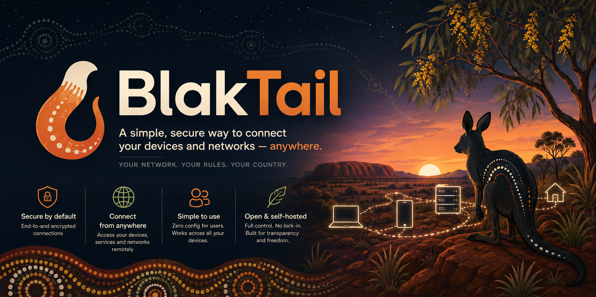

# BlakTail



## A private path between your organisation's devices

BlakTail is open, self-hosted private networking designed for Indigenous
Australian organisations. It connects laptops, field devices, servers, and sites
with encrypted WireGuard links while keeping control of identity, policy, keys,
and operational data with the organisation.

> Built by Indigenous Australians for Indigenous Australian organisations. Data stays onshore, Indigenous Australian organisations stay in control, and the code stays public.

The project is designed for onshore operation, organisation control, and
public-code transparency.

The idea is closer to a **BlakPath** than a generic VPN: a trusted path between
the people, devices, services, and places an organisation already manages. The
repository, console, and binaries retain the **BlakTail** name during pre-release
so operators have one consistent technical identity.

### What that means in practice

- **Your network:** each organisation has its own private address space, device
  inventory, MagicDNS names, routes, and access rules.
- **Your rules:** owners and admins approve enrolment, assign tags, give devices
  friendly names, approve routes, audit changes, and revoke access.
- **Your country:** the supplied cloud deployment is pinned to Sydney, and the
  project documents which data and supporting systems must remain onshore.
- **Your choice:** run it yourself, inspect the code, and move between supported
  hosts without depending on a closed SaaS control plane.

## How onboarding feels

1. Run `blaktaild up` on a new Linux or macOS device.
2. Open the short browser link it prints and sign in to the organisation portal.
3. Check the requested device name and WireGuard-key fingerprint, then approve it.
4. Give the device a clear friendly name such as “Community office iMac” or
   “Ranger ute tablet”. The technical hostname and MagicDNS identity stay stable.
5. Connect by private address or name. Direct UDP is preferred; the Australian
   relay is the encrypted fallback.

## Project status

BlakTail is pre-release. There are no published agent tags or install artifacts yet;
build from source until the release checklist in
[docs/releases.md](docs/releases.md) has been completed on clean hosts.

Browser onboarding, friendly device names, direct candidates, an Australian relay
fallback, and nonce-confirmed UDP hole punching are implemented. The literal
forced-relay proof across two independent NAT paths is still pending in
[#24](https://github.com/jusso-dev/BlakTail/issues/24), so NAT traversal is not yet a
production-verified claim. Dual-stack traffic passed on two private AWS agents, but
the IPv6-only drill with each BlakTail IPv4 address removed remains open in
[#32](https://github.com/jusso-dev/BlakTail/issues/32).

“Onshore” is a deployment responsibility as well as a product rule. Included AWS
infrastructure is pinned to Sydney and the relay rejects non-Australian cloud region
identifiers; self-hosters must independently keep the console database, coordinator
state, TLS proxy, logs, backups, DNS, and support tooling in Australia.

## What works today

- Browser-based device enrolment without copying a join key
- Organisation device inventory with stable technical identity and editable,
  audited friendly names
- Join-key enrolment for automation, tags, route approval, ACLs, and revocation
- Next.js 16.3 console: Drizzle ORM, Better Auth, talks to the Rust control plane for auth and ACLs
- WireGuard agents for Linux and macOS; Windows is not implemented
- A macOS desktop app that drives the local agent; Windows and Linux desktop apps
  are not implemented
- Coordination server and AU relay the org runs
- MagicDNS-style names and tag ACLs (office, ranger, store)
- Owner-approved Linux subnet routers and opt-in IPv4 exit nodes
- Dual-stack tailnets with an organisation ULA `/64` and one `/128` per node
- Prometheus coordinator/relay metrics and an actor-attributed admin audit log

## Current boundaries

- No SaaS control plane outside Australia
- No closed-source agent
- No published release artifacts yet; source builds are the supported pre-release path
- No Windows agent or Linux desktop tray yet
- Not a file sync tool (that is BlakSync)
- Not a clone of Tailscale's trademark or UI assets
- No Go or Zig

## Console

Operator UI lives in `apps/console` (Next.js 16.3, Better Auth, Drizzle, onshore Postgres).
See [docs/console.md](docs/console.md).

Fresh deployments use one explicit, time-limited first-owner ceremony from the
console host. Public Better Auth sign-up is disabled at the HTTP endpoint. After
bootstrap locks, owners add people with one-use, organisation-bound invitations;
lost sole-owner access requires an audited on-host recovery. See
[First owner and invitations](docs/console.md#first-owner-and-invitations).

Metrics, audit coverage, and alert examples: [docs/observability.md](docs/observability.md).
The public data-handling page is `/privacy`; operator duties and current retention
limits are in [docs/privacy.md](docs/privacy.md).

## Agent install

Until the first release is published, build the agent on its target operating system:

```sh
cargo build --locked --release -p blaktaild -p blaktail-config
sudo install -m 0755 target/release/blaktaild /usr/local/bin/blaktaild
sudo install -m 0755 target/release/blaktail-config /usr/local/bin/blaktail-config
blaktail-config check-config --service agent
```

Release packaging and the checksum-verifying installer support macOS `.pkg`, Debian
`.deb`, and RPM `.rpm` artifacts, but they intentionally fail when the selected
GitHub release does not exist. See [docs/releases.md](docs/releases.md) and the
[upgrade/version-skew policy](docs/upgrades.md).

## Deployment

Host it yourself on one box, or run the isolated AWS proof harness:

- **Single EC2 / any Docker host:** `compose.yaml` quickstart in [docs/deploy-aws.md](docs/deploy-aws.md).
- **Disposable AWS E2E:** guarded Terraform in `deploy/aws/e2e` runs ARM64 Fargate
  console/coordinator/relay tasks plus two private agent hosts, all pinned to Sydney.
  Images are immutable digest references built by `scripts/aws-e2e/build-images.sh`.
- **Persistent AWS:** blocked on [#27](https://github.com/jusso-dev/BlakTail/issues/27).
  The legacy `deploy/aws` coordinator declares its SQLite-on-EFS shape and now
  fails schema validation instead of presenting that unsafe store as production.

All services share schema-v1 TOML plus deterministic environment overrides.
`blaktail-config` validates offline, prints only redacted effective config, previews
restart-required changes, and creates operator-confirmed redacted support bundles.
Normal service startup validates before listeners; coordinator and console
migrations are separate gates. See [operator configuration](docs/configuration.md).

The Compose/AWS files are deployment inputs, not evidence of a running production
service. Verify TLS, health, metrics, storage, backups, privacy contact/retention,
and an enrolled node on the actual destination.

### Verified AWS smoke run

Hardened rerun `20260824i35a` deployed immutable ARM64 console, coordinator, and
relay images in Sydney. The supported one-shot ceremony created and locked exactly
one owner; live HTTP proof then rejected public signup with
`EMAIL_PASSWORD_SIGN_UP_DISABLED`, signed that owner in, and loaded the authenticated
Devices page. Private Ubuntu and Amazon Linux agents passed bidirectional IPv4,
IPv6, MagicDNS, overlay-route, and SSH checks over `blaktail0`. Terraform destroyed
all 95 resources, the residue guard returned zero, and local cookies, enrollment
URLs, passwords, and Terraform state backups were removed.

The screenshots below are visual evidence from earlier disposable browser run
`20260823t120928z`, not screenshots from the hardened rerun. Current-run screenshot
capture failed before browser control began because the managed Chrome runtime could
not import `node:process`; the run report records that gap instead of relabelling old
images as new evidence.


See the [redacted run report](docs/e2e/aws-fargate-run.md),
[#35](https://github.com/jusso-dev/BlakTail/issues/35), and
[#34](https://github.com/jusso-dev/BlakTail/issues/34). These are current-commit
smoke proofs, not release proof: forced relay traffic, revocation/re-enrolment, all
restart cases, and a published agent package remain open acceptance work.

## Stack (locked for first cut)

- Rust workspace: `blaktaild` (node agent), `blaktail-coord`, `blaktail-relay`
- WireGuard: userspace on macOS first, kernel WG on Linux, userspace on Windows
- Console: Next.js 16.3, Drizzle, Better Auth, Postgres onshore. Auth sessions are issued in the console and verified by Rust
- Desktop: Mac app first (SwiftUI wrapping the LaunchDaemon agent). Windows and Linux follow
- CI on GitHub-hosted runners: `ubuntu-latest` for Rust, console, and security jobs; `macos-latest` for the Swift desktop app
- Apache-2.0

## Threat model

Keys, the onshore control plane, and relays: [docs/threat-model.md](docs/threat-model.md).

That document names the assets (node private keys, join keys, coordinator DB, ACL, relay metadata), the attackers we design for (stolen laptop, leaked join key, curious relay operator, offshore SaaS mistake), the required controls (region pin, `0600` key files, revoke, no payload logs on the relay), and the limits we will not paper over (metadata, unlocked disk, join-key theft). Revoke steps there are copy-pasteable.

## What never goes in git

The repository is public. Secrets are organisation-held and stay off GitHub.

Do not commit:

- Node WireGuard private keys, TLS private keys, PSKs (`*.key`, `*.pem`, `*.psk`)
- Join keys (`btk_…`) or node tokens (`btn_…`)
- Coordinator SQLite/Postgres dumps
- `.env`, `BETTER_AUTH_SECRET`, `BLAKTAIL_AUTH_HMAC_SECRET`, database URLs
- Live WireGuard configs (`wg*.conf`)

`.gitignore` blocks the common filename patterns. CI runs gitleaks on every push, plus `cargo deny` against `deny.toml`. A throwaway branch that commits a dummy secret is required to fail that job (`scripts/ci/prove-gitleaks-detects-dummy.sh`). If a real secret lands in git, rotate it; deleting the file in a later commit does not erase the blob.

## macOS desktop

SwiftUI menu bar app in `apps/macos`. Minimum **macOS 14 Sonoma**. Signs in via Better Auth (ASWebAuthenticationSession), stores the session token in Keychain, and starts/stops local `blaktaild` without the terminal. Join keys travel on stdin only and are not left in argv on quit.

See [`docs/macos-desktop.md`](docs/macos-desktop.md) for build steps, manual validation, and **notarisation** notes (do not buy signing certificates in CI).

```bash
bash scripts/validate-macos-desktop.sh
# on a Mac runner or Mac workstation:
cd apps/macos && swift test
```
