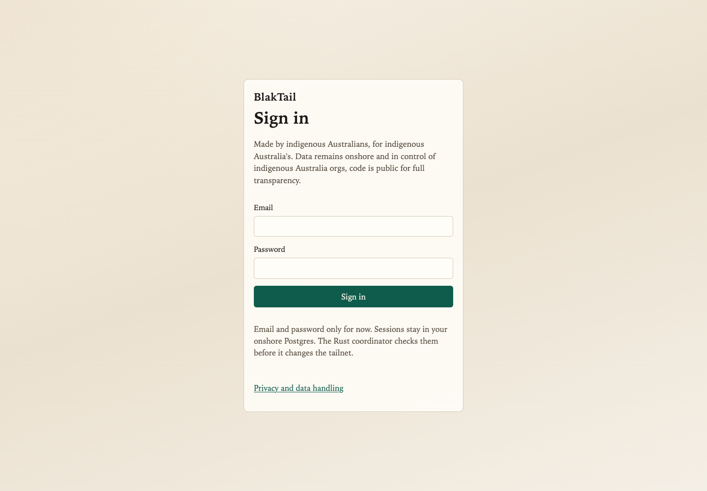
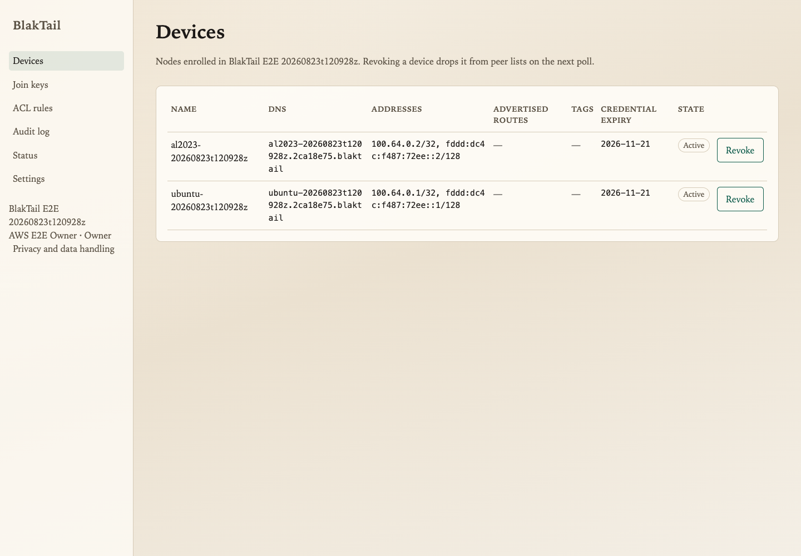
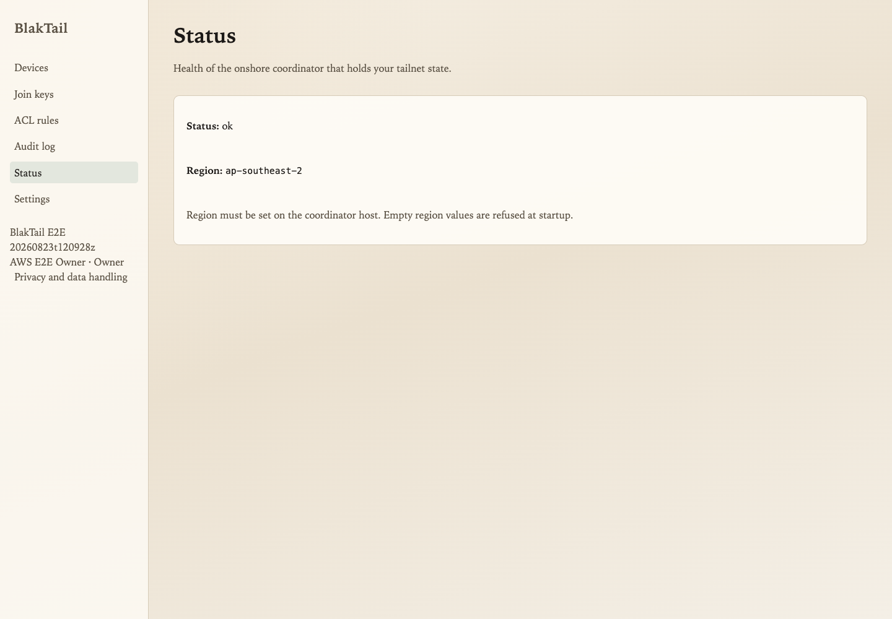
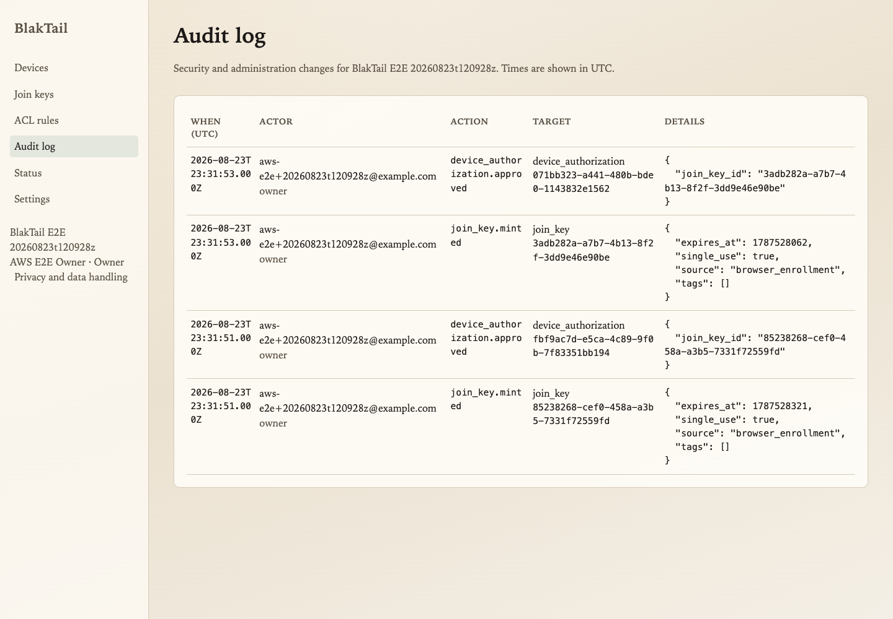
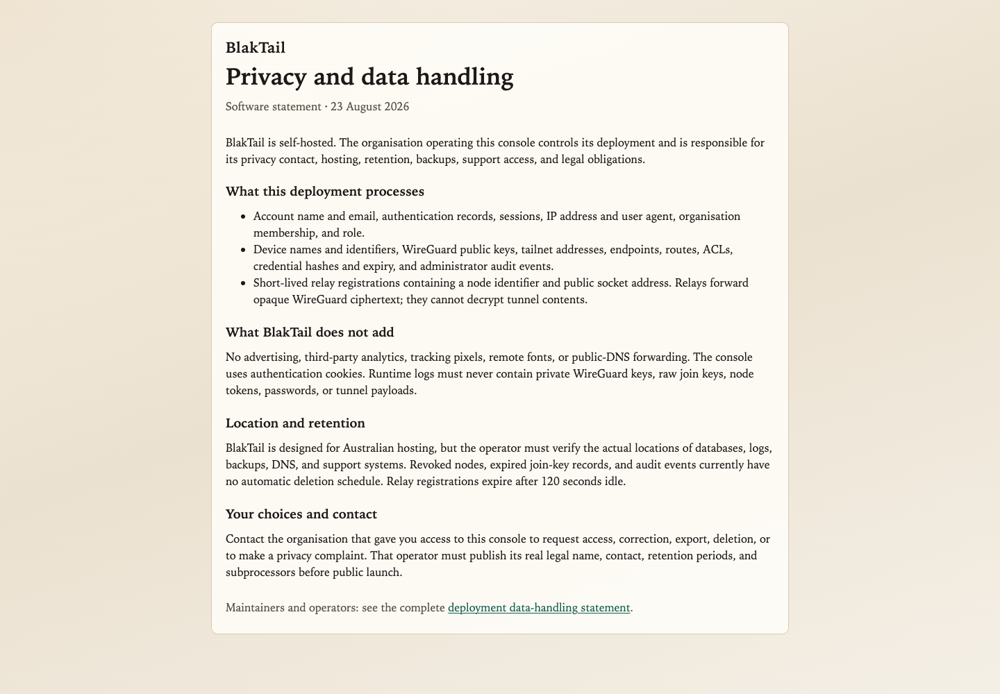

# AWS Fargate smoke runs — 23–24 August 2026

## Hardened first-owner rerun — `20260824i35a`

Run `20260824i35a` exercised the supported [#35](https://github.com/jusso-dev/BlakTail/issues/35)
first-owner boundary at commit `2b61be4a42a1ec130e1ce44fd3e731a337941b9f`.
Credential-free evidence was sealed at `2026-08-24T05:13:21Z`; guarded teardown
then destroyed 95 resources and reported zero scoped residue.

```text
region: ap-southeast-2
supported_one_shot_bootstrap: passed
public_signup: HTTP 400 EMAIL_PASSWORD_SIGN_UP_DISABLED
owner_login: HTTP 200
authenticated_devices_page: HTTP 200
private_agent_enrollment: passed
bidirectional_ipv4_ipv6: passed
magicdns_overlay_routes_ssh: passed
teardown: 95 destroyed, scoped_residue=0
```

The owner password crossed only a temporary encrypted run-bucket object readable by
the private console task role; the object was deleted after bootstrap. The live
verifier kept its request body, session response, and cookie jar in mode-`0600`
temporary files, emitted only status/code assertions, and removed those files on
exit. Public organisation creation was no longer the bootstrap mechanism.

The authenticated enrollment pages rendered the approval control and WireGuard-key
fingerprint. The managed Chrome control runtime then failed during bootstrap because
its bundled client attempted an unavailable `node:process` import, before it could
control a tab or take a screenshot. To finish the expiring infrastructure proof
without misrepresenting UI evidence, a one-off private console task approved the two
protected device codes with fresh issuer-, audience-, expiry-, nonce-, actor-, role-,
and organisation-bound assertions. The screenshots later in this report therefore
remain evidence from `20260823t120928z`; none is labelled as current-run evidence.

The immutable image digests were:

```text
console:     sha256:f3d5b76824a49c4e77fd17d48ef88875054b2c58eabbc4c5bcc9b07ab9afdd6c
coordinator: sha256:3858af25258df4206cdae4eeb19d9c67bd08642d4a939f099c69cb840b597684
relay:       sha256:bae97669fba90ad8e113162feb2a7333543ded975ee4f18afee777601fd96911
TLS bridge:  sha256:3214e863db4bb6c0a547faf290d782e547752f6c7aa3039ae433f1977d00a073
```

The ARM64 package checksums were:

```text
RPM: 054b4f9d4a3fc8ca4bd9f25f1158d957ea4261b06f9e309edcd267623ca8a307
DEB: 700191d9a3033ccf114e72dbebf1bbeb85b17b2f3cd3250bfb7bbaba614f331e
```

Both agents had no public IP and no inbound SSH. Each direction proved IPv4, IPv6,
MagicDNS, `blaktail0` route ownership, relay configuration, and SSH to the other
agent's BlakTail DNS name. After AWS absence verification, the harness removed the
owner password; an independent audit also found and removed a retained cookie jar,
enrollment URLs, the empty state, its secret-bearing pre-destroy backup, and the
destroy context. The destroy script now removes those artifacts automatically.

## Historical browser run — `20260823t120928z`

This is the public, credential-free record for disposable run
`20260823t120928z`. It proves the browser onboarding and private-node remote-access
slice of [#34](https://github.com/jusso-dev/BlakTail/issues/34); it does not close
that issue's release-grade lifecycle matrix.

## Result

```text
run_id: 20260823t120928z
region: ap-southeast-2
harness: passed
control_plane_and_login: passed
agent_remote_access: passed
network_lifecycle: partial
readme_and_checks: passed
teardown: passed (active-resource scope)
overall_issue_acceptance: partial
```

The AWS account allowlist and live caller identity matched before each mutation;
the account number is redacted here. Evidence was captured at
`3a3be505aedbdaf6b7fbb07cee802e0d189c4618`. The run began at
`2026-08-23T12:09:28Z`, evidence was sealed at `2026-08-23T23:48:52Z`, and final
active-resource absence was verified on `2026-08-24` UTC.

## Deployed shape

- Dedicated two-AZ VPC in Sydney.
- Public AWS API Gateway HTTPS endpoint using AWS's trusted certificate, privately
  integrated through a VPC link to an internal ALB.
- Private ARM64 Fargate services for console, coordinator, coordinator TLS bridge,
  and UDP relay. Coordinator and relay stayed at one task.
- Private RDS Postgres for console identity and membership; EFS-backed coordinator
  SQLite for this short smoke run.
- One private Ubuntu ARM64 agent and one private Amazon Linux 2023 ARM64 agent,
  each using a separate NAT-instance route. Neither had a public address or inbound
  TCP/22 rule. Agents stayed on EC2 because faithful `blaktaild` operation needs a
  TUN device, routes, firewall changes, and `CAP_NET_ADMIN`, which Fargate cannot
  provide.
- SSM performed package bootstrap only. Acceptance SSH used a BlakTail MagicDNS
  name and a route owned by `blaktail0`.

The control-plane image references were immutable:

```text
console:     sha256:27cd9896a62ee47a4d856ebb0fa84961cf48b524e7ab89d8464b2bd990dff5b1
coordinator: sha256:336058394266ad2db40661ee80d95e3a5dc4ac82bbfbd78db12f8d00deafc663
relay:       sha256:bae97669fba90ad8e113162feb2a7333543ded975ee4f18afee777601fd96911
TLS bridge:  sha256:3214e863db4bb6c0a547faf290d782e547752f6c7aa3039ae433f1977d00a073
```

Both agents reported `blaktaild 0.1.0`. Commit-built package checksums were:

```text
RPM: 35123f1f4c5b81084236598fef2845e6876697046b906d801520674118da9ffe
DEB: 7f714933db1cdb3578df7d23673d9357227a0e59d56cd71459052a8b38f4a622
```

The configured remote ARM64 Docker host became unavailable during bring-up.
Run-scoped CodeBuild projects rebuilt the coordinator and console images; their
projects, roles, policies, logs, and source objects were deleted and independently
checked absent. The normal harness still fails closed unless its named ARM64 Docker
context is available.

## Browser and data-plane evidence

The password was generated in browser-process memory, never printed or saved, and
became unusable when the stack was destroyed. Better Auth created the credential;
a one-shot Fargate task linked that real user to the coordinator organisation as
owner. A fresh browser then signed in and observed both approved agents.

That paragraph records the historical `3a3be505` flow exactly; direct membership
linking and public sign-up are not the current supported ceremony. The hardened
harness now runs the on-host, one-shot bootstrap CLI inside a private Fargate task,
keeps its bootstrap token inside that task, transfers the owner password through a
temporary encrypted run-bucket object, deletes that object on exit, and records
only a redacted `supported_bootstrap` marker.











For both directions, the remote proof required all of these markers before saving
evidence:

```text
ssh=ok (aarch64)
ipv4=ok
ipv6=ok
magicdns=ok
relay_configured=ok
overlay_routes=ok
```

Ubuntu received `100.64.0.1/32` and
`fddd:dc4c:f487:72ee::1/128`; Amazon Linux received `100.64.0.2/32` and
`fddd:dc4c:f487:72ee::2/128`. Both MagicDNS names resolved to their overlay A and
AAAA records. The SSH destination route named `blaktail0`; no VPC address or SSM
session substituted for it. After the Amazon Linux instance stop/start, its
mode-`0600` state and systemd service resumed, and the complete bidirectional proof
passed again.

No password, cookie, enrolment code, join-key value, node private key, SSH private
key, or cloud secret appears in these screenshots or the collected evidence.

## Validation

Passed locally after the run:

- Terraform formatting and validation for `deploy/aws/e2e`.
- POSIX shell parsing, ShellCheck warning level, fail-closed static tests, and
  actionlint.
- Rust formatting, workspace clippy with warnings denied, and 55 tests across nine
  suites.
- Console lint, typecheck, and production build. Lint retained two pre-existing
  warnings in the desktop auth page and no errors.

The local machine had only Apple Command Line Tools, so it could not import
`XCTest`; the repository's macOS job remains the authoritative Swift test gate.

## Teardown evidence

Guarded destroy used the exact account, region, run ID, Terraform state, and
confirmation token. An expired short-lived provider token interrupted the first
wait after RDS deletion had started; the resumable destroy context then completed
the remaining state safely. Final checks found:

- empty Terraform state;
- zero live run VPCs, EC2 instances, ECS clusters or active task definitions, RDS
  instances, EFS file systems, load balancers, API Gateway APIs, ECR repositories,
  S3 buckets, Secrets Manager secrets, CloudWatch log groups, or IAM roles;
- all nine inactive ECS task-definition revisions explicitly queued for deletion;
- no active object among the RunId-tagged inventory.

AWS's Resource Groups Tagging API still returned 23 historical records at the last
check: four terminated EC2 instances, six stopped ECS tasks, nine task definitions
queued for deletion, three inactive ECS services, and one inactive cluster. Their
service APIs reported only terminated, stopped, inactive, or deletion-queued state;
AWS returned no exact purge timestamp. Strict zero-tag-history acceptance therefore
remains pending even though no live or billable run infrastructure remained.

## Work still open in #34

This run did not prove a published release artifact, forced relay packet flow and
metric delta, direct-path restoration, Ubuntu reboot persistence, stopping SSM
during SSH, coordinator/console restart persistence, code reuse/outsider cases,
revocation, or browser re-enrolment. Coordinator SQLite-on-EFS and generated secrets
inside protected local Terraform state are smoke-only boundaries. At this run's
historical commit, public signup and the unauthenticated coordinator
organisation-bootstrap endpoint still needed production hardening; current code
disables framework sign-up and requires one-use, action-scoped service assertions
for staged organisation activation. Cost Explorer data was not yet available.
The remaining lifecycle gaps keep #34 open.
